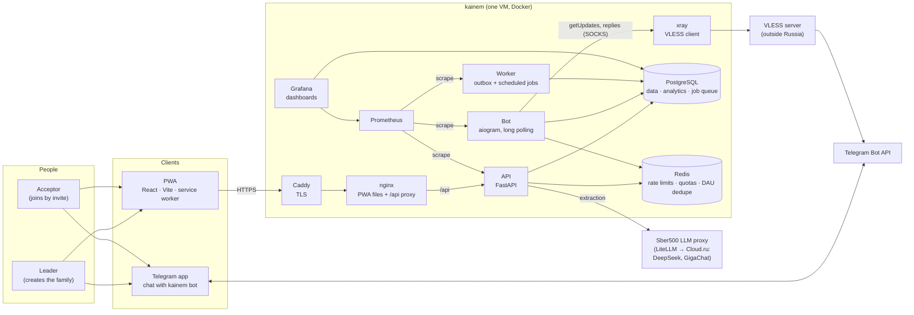
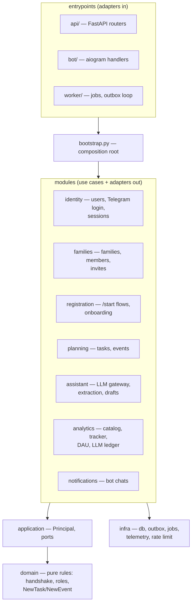
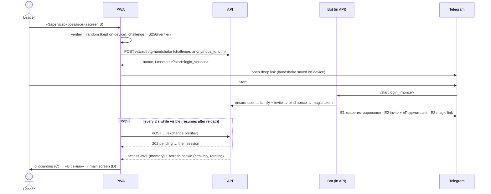
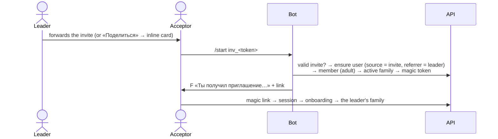
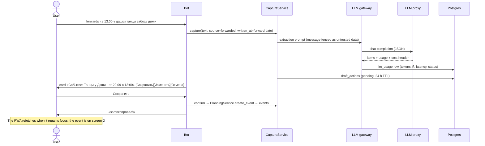
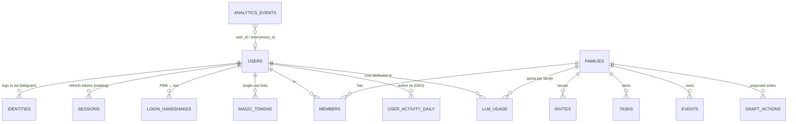
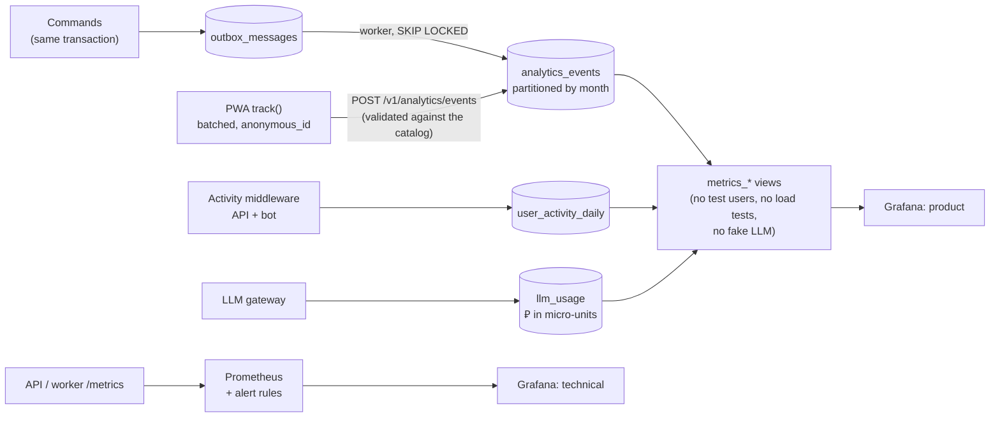

# kainem — system architecture (as built)

This describes the system as implemented: MVP milestones M0–M5. Decisions and their reasons are in [`docs/adr/`](adr).

kainem is a family assistant with two surfaces:
- a **PWA** (web app), where the family sees its tasks and events;
- a **Telegram bot**, which registers the family, sends invite links, and turns forwarded messages into tasks and events after the user confirms them.

## 1. System context

## 2. Deployment

`infra/compose.prod.yml` runs everything on one VM in a Russian cloud (152-FZ). Only Caddy is public; it also serves Grafana at `/grafana/` (sign-in required). Prometheus listens on `127.0.0.1` and is reached through an SSH tunnel. Telegram is blocked in Russia, so the bot long-polls the Bot API through a VLESS proxy instead of receiving a webhook (ADR 0004).

| Container | Role | Scales by |
|---|---|---|
| `caddy` | TLS (Let's Encrypt), the only public ports (80/443) | — |
| `web` | nginx: PWA static files; `/api/*` → API. Blocks `/api/metrics`, sets the real client IP | stateless |
| `api` | FastAPI REST, 2 uvicorn workers; runs migrations on start. Also serves the Telegram webhook route, unused in production (ADR 0004) | more workers or containers (stateless) |
| `bot` | aiogram in long-polling mode: commands, invites, capture; metrics on `:9102` | exactly one per bot token |
| `xray` | Xray-core VLESS client: SOCKS proxy `xray:1080` for Bot API traffic only; config from the `XRAY_CONFIG` secret | — |
| `worker` | Procrastinate jobs (spend check, price sync, draft expiry, partitions, cleanup) + the outbox dispatcher loop | one is enough; the dispatcher uses `SKIP LOCKED` |
| `postgres` | All data, analytics tables, the job queue (pgvector image, ready for embeddings later) | managed Postgres later |
| `redis` | Rate limits, per-family LLM quota, DAU dedupe, bot «Изменить» state | — |
| `prometheus`, `grafana` | Technical and product dashboards, alert rules | — |

Load test ([`load-test.md`](load-test.md)): **10.2 RPS with 0 errors** (p95 75 ms) and 52 RPS with 0 errors. The API used about 7% of one core at 10 RPS.

## 3. Code structure

A **modular monolith with ports and adapters**. Both toolchains live in one repo:
- the backend is Python 3.13 (uv);
- the frontend is TypeScript (pnpm workspace);
- `contracts/openapi.json` is the contract between them, and CI fails if the generated TS client drifts from the backend.

**Rules**, enforced in CI by `import-linter`:
- the domain imports no frameworks and does no I/O;
- infra never imports modules or entrypoints;
- layers only depend downward.

**Every write goes through a command.** The PWA, the bot and the LLM drafts all create tasks through the same `PlanningService` call. Validation, family scoping and analytics therefore live in one place.

**Frontend packages:**
- `ui-kit`: the Figma tokens and components.
- `platform`: the `PlatformAdapter` for PWA vs a future Telegram Mini App, including add-to-home-screen.
- `api-client`: generated from the OpenAPI spec; refreshes on 401.
- `analytics`: batched client events with an `anonymous_id`.
- `app-core`: screens, routing, the session gate, TanStack Query.
- `apps/pwa`: the thin shell.

## 4. Key flows

### 4.1 Leader registration: the PWA logs in through the bot (ADR 0002)

The nonce appears in a public URL, but it is useless without the verifier. On iOS, a PWA installed to the home screen doesn't share storage with Safari. Polling works there, while a link from Telegram would open in Safari.

### 4.2 Acceptor joins by invite

A dead or revoked invite creates no account. The bot offers «Создать своё пространство» instead.

### 4.3 Capture: a message becomes a task or event (screens G → H)

Nothing is written before «Сохранить» (propose → confirm). If the LLM is unavailable (budget, timeout, invalid output) or finds nothing, the card offers «Сохранить как задачу» without the LLM.

Photos and image files take the same path (ADR 0005): the extraction model is a vision model, the bot downloads the image into memory (never stored), and the caption is the message text. A photo without a caption that can't be read gets a "write it as text" reply instead of a «Сохранить как задачу» card.

## 5. Data model

- **Tenancy:** every family-owned row has `family_id`. Family-scoped routes (`/v1/families/{id}/…`) check membership on each request.
- **Time:** instants are stored in UTC with the family's IANA timezone; all-day events and due dates are dates.
- **Secrets at rest:** login tokens, magic links and refresh tokens are stored as SHA-256 hashes.

## 6. Analytics and metrics

- **Server events are transactional:** they are written through the outbox in the same transaction as the change, so "created but not counted" can't happen.
- **Client events** are validated against the event catalog; pre-login events are accepted only from an allowlist.
- **DAU** follows ADR 0003: user-initiated actions only, reporting day in Europe/Moscow, one row per user, day and platform.
- **LLM cost** comes from the ledger: one row per provider call with the proxy-reported cost. The analysis is in [`llm-cost-per-dau.md`](llm-cost-per-dau.md).
- **Dashboards:** "kainem — technical" covers request rate, 5xx share, latency, bot, LLM, outbox and analytics rejects. "kainem — product" covers DAU/WAU/MAU, platforms, new users and families, the registration and invite funnels, AI confirm rate, ₽/day, ₽/DAU, retention and activation.
- **Alerts:** 5xx above 2%, high latency, bot failures, bot down or Telegram unreachable through the proxy, LLM failures and budget exhaustion, outbox lag, analytics rejects. Spend alerts fire at 50% and 80% of the program budget.

## 7. Security

- **Auth:**
  - Telegram identity only.
  - A PKCE-style handshake and single-use hashed magic links.
  - Access JWTs live 15 minutes in memory only.
  - Refresh cookies are httpOnly, SameSite=Lax, scoped to `/api/v1/auth`, and rotate on every use. Reusing a rotated one revokes the whole login.
- **Rate limits:**
  - Per IP on login and pre-login analytics; per user on bot captures.
  - The client IP is set by the edge (Caddy → nginx) and can't be spoofed with `X-Forwarded-For`.
- **Webhook:** when used, Telegram calls are verified by the secret token header. Production long-polls instead (ADR 0004).
- **LLM:**
  - Message text is fenced as data, and prompt injection is part of the eval set.
  - Nothing is written without user confirmation.
  - There's a per-family daily ₽ quota and program budget alerts.
  - Only first names go to the model, no contact data.
- **Test-only endpoints** exist only when `ENABLE_TEST_ENDPOINTS=true` *and* `ENV` is `local` or `test`. The API refuses to start in staging or production with the development JWT secret.
- **Data residency:** the VM runs in a Russian cloud, and the LLM is Cloud.ru via the Sber500 proxy (ADR 0001).

## 8. Where things are

| | |
|---|---|
| Decisions | [`docs/adr/`](adr): 0001 LLM provider, 0002 PWA login through the bot, 0003 active user, 0004 Telegram through a VLESS proxy, 0005 photo capture through a vision model |
| Load test | [`docs/load-test.md`](load-test.md), `backend/loadtest/locustfile.py` |
| LLM cost per DAU | [`docs/llm-cost-per-dau.md`](llm-cost-per-dau.md), `python -m planner.cli cost-report` |
| Extraction quality | `backend/tests/evals/` (`pytest -m eval`) |
| Metrics definitions | `backend/migrations/versions/*_m5_metrics_views.py` |
| Dashboards and alerts | `infra/grafana/`, `infra/prometheus/` |
| Deployment | `infra/compose.prod.yml`, `infra/.env.prod.example`, README "Deploy" |
